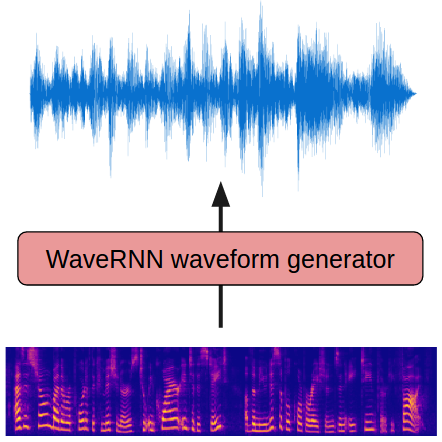

# wavernn-demo
WaveRNN-based waveform generator for audio synthesis using TensorFlow CuDNN GRU network.



Since this was part of a private Insight fellowship project, the model
structure and training code could not be open-sourced. This public repo is a
demo of the final model trained on 13000 spoken sentences; inference can be run
on CPU or GPU using the frozen graph.

`run_wavernn.py` takes an input WAV file, applies an FFT to produce an 80-band
mel spectrogram, then uses the spectrogram to generate 16 kHz audio with a
frozen WaveRNN model.

`cudnn_gru.ipynb` demonstrates usage of the (poorly documented) CuDNN GRU cell
in TensorFlow, and some of the tricks and workarounds needed to get the network
up and running. See [this link](http://htmlpreview.github.io/?https://github.com/austinmoehle/wavernn/blob/master/cudnn_gru.html)
for an HTML-rendered version.

## Setup
Create a virtualenv, activate then run
```
pip install -r requirements.txt
```

## Run
Choose an input WAV file and run, e.g.
```
python run_wavernn.py samples/LJ016-0277.wav
```

## CuDNN GRU in TensorFlow - Code and Demonstration
For this model, Nvidia's highly optimized CuDNN GRU trained __7x__ faster
than a slow TensorFlow while-loop with explicit TF operations. Unfortunately,
I couldn't get the `CudnnGRU` module to work out-of-the-box so I resorted to
some workarounds to make the cell usable. The Jupyter
[notebook](cudnn_gru.ipynb) contains code snippets from the original model,
along with an example of how to replicate the CuDNN GRU cell in native
TensorFlow.

Requires __tensorflow-gpu__.
